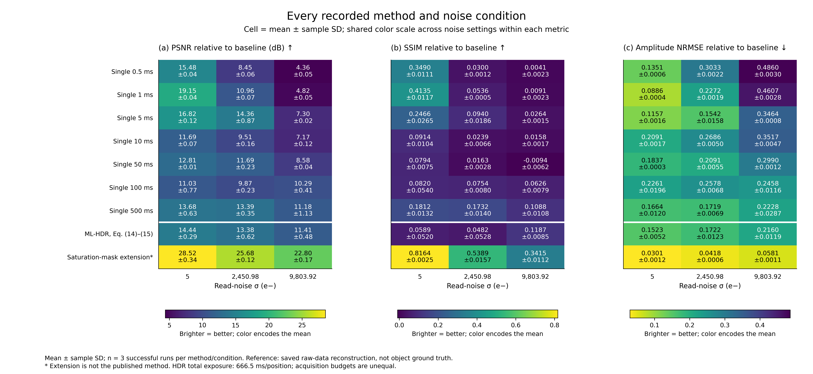
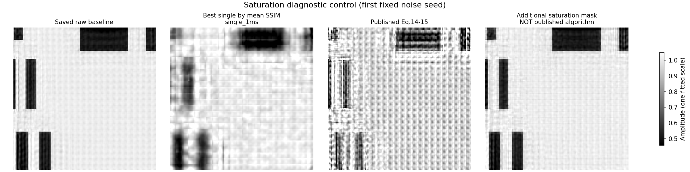

# ML-HDR Ptychography Reproduction

A Python and PtyLab implementation of ML-HDR ptychography with controlled comparison experiments. Following Liu et al., IEEE TIM 2024, the fixed reconstruction configuration compares a raw-data baseline, single-exposure reconstructions at different exposure times, and fusion using Eqs. (14)–(15) of the paper.

**Current finding: under this project's data and recorded camera assumptions, the original paper equations do not consistently outperform the best single exposure. An additional control that masks saturated pixels improves the results substantially, but this extension is not part of the paper's original algorithm.** Both methods and their differences are retained; the extension's gains are not attributed to the original equations.

[Results and limitations](docs/results.md) · [Restore and continue on another device](docs/REPOSITORY_RESTORE.md) · [Parameters and sources](experiments/paper_baseline_comparison.json) · [Complete metrics](docs/summary_metrics.csv) · [Result audit](docs/validation_record.json)

Four sets of paper-style comparisons cover all exposure curves, all-method heatmaps, fixed methods across noise scenarios, and diffraction error and saturation diagnostics. They read the 27 saved summary rows covering all 81 reconstructions, without rerunning the algorithm. The layouts follow the multi-method comparisons in Figs. 2 and 3 of the paper. These figures use the fixed-baseline experiment and do not add LRFC-HDR, bit-depth sweeps, or measured resolution results.





A separate set of **paper-style simulation comparisons** follows the layouts of Figs. 2, 3, 5, 6, and 7: bit-depth sweeps, noise sweeps, multi-exposure diffraction images, and USAF resolution results, with digitized paper curves overlaid on this project's results. The saved simulations have known ground truth and include LRFC-HDR, 8/16-bit comparisons, and ground-truth-referenced FRC. The paper reports object and detector dimensions, scan settings, and iteration counts. This project retains 400 positions and 250 iterations, uses smaller images, a smaller detector, and a smaller scan step, and explicitly records camera and exposure assumptions not determined by the paper. See [paper-style simulation comparisons](docs/results.md#paper-style-simulation-comparisons) and [key numerical comparisons](docs/paper_style/summary.md).

## Repository contents

The repository contains code, documentation, summary metrics, main comparison figures, and all currently saved paper-style simulation data in `outputs/paper_style/full/` and `quick/`. Each simulation directory contains nine files: ground truth, representative complex reconstruction arrays, convergence and FRC data, USAF geometry and profiles, diffraction examples, and a data contract. After cloning on another device, these files support direct figure regeneration and further analysis. The reference paper is available through its [DOI](https://doi.org/10.1109/TIM.2024.3363788); its PDF is not distributed with the repository.

The historical fixed-baseline experiment's raw `diff.npy`, baseline archive, and complete outputs for its 81 reconstructions were already missing from the working directory. Only that experiment's existing summary metrics, images, and audit records are retained. They are accounted for separately from the fully saved simulation data; the historical raw-data experiment cannot be rerun from summary files alone.

| Path | Purpose |
|---|---|
| `mlhdr_ptycho/data.py` | Diffraction loading, center cropping, scan coordinates, and normalization |
| `mlhdr_ptycho/ml_hdr.py` | Initial camera simulation and paper fusion equations |
| `mlhdr_ptycho/paper_reproduction.py` | Camera simulation, fusion, and comparison metrics with explicit physical units |
| `mlhdr_ptycho/ptylab_reconstruction.py` | PtyLab mPIE wrapper and result export |
| `scripts/reproduce_paper.py` | Complete fixed-baseline comparison experiment |
| `scripts/plot_paper_comparisons.py` | Four sets of PNG/SVG comparisons from saved summary metrics |
| `mlhdr_ptycho/comparison_figures.py` | Comparison-data validation, consistent plotting, and provenance records |
| `mlhdr_ptycho/simulation.py` | Paper-style simulations: cameraman/USAF objects, camera model, and four fusion methods |
| `mlhdr_ptycho/mpie.py` | Pure NumPy mPIE reconstruction for paper-style simulations |
| `mlhdr_ptycho/resolution.py` | Alignment, PSNR/SSIM/NRMSE, ground-truth-referenced FRC, and USAF resolvability |
| `scripts/run_paper_style_simulation.py` | Bit-depth, noise, diffraction, and 8/16-bit USAF simulations; output fields are documented in the generated `DATA_CONTRACT.md` |
| `mlhdr_ptycho/paper_style_figures.py` | Paper-style data validation, six figure sets, provenance manifest, and key numerical tables |
| `scripts/plot_paper_style_figures.py` | Paper-style PNG/SVG generation, `summary.csv`, and copies of small data files |
| `docs/paper_style/` | Digitized paper values (`paper_digitized.json`), numerical comparisons, and simulation CSV/JSON inputs |
| `outputs/paper_style/full/` | Saved full simulation with 250 iterations and three seeds; direct input for the six paper-style figure sets |
| `outputs/paper_style/quick/` | Saved 20-iteration smoke run using the same data contract as full |
| `requirements-simulation.txt` | Python 3.12 simulation and plotting environment, without PtyLab |
| `docs/REPOSITORY_RESTORE.md` | New-device installation, data-integrity checks, figure regeneration, and further experiments |
| `scripts/verify_repository_data.py` | Saved-file size and SHA-256 verification against the repository manifest |
| `scripts/validate_paper_results.py` | Audit of complete local experiment outputs |
| `scripts/run_reconstruction.py` | Single raw/single/mlhdr experiment |
| `scripts/inspect_diff.py` | Input statistics and diffraction previews |
| `scripts/sweep_reconstruction_params.py` | Reconstruction parameter sweep |
| `scripts/compare_single_exposures.py` | Earlier single-exposure comparison script |
| `experiments/` | Experiment settings and sources of paper parameters and additional assumptions |
| `tests/` | Equation, camera-statistics, and metric validation |
| `docs/` | Completed-experiment documentation, metrics, and main figures |

## Completed experiment

All comparisons use the same baseline configuration:

| Parameter | Setting |
|---|---|
| Scan region | Central `21×21`, 441 positions |
| Detector frame | `32×32` pixels |
| Scan step | 8 object-plane pixels |
| Initial probe | `circ_smooth`, diameter 31 object-plane pixels |
| Initial object | `ones`, including small random perturbations as defined by PtyLab |
| Algorithm and iterations | CPU mPIE, 80 iterations |
| Wavelength / object-plane pixel / detector pixel | 632.8 nm / 1 μm / 5.5 μm |
| Propagation and update order | Fraunhofer, random traversal, reconstruction seed 0 |
| Corrections | Probe-power correction enabled; position correction disabled |

The seven exposures are **0.5, 1, 5, 10, 50, 100, and 500 ms**. Each of three noise scenarios uses three fixed camera seeds, giving **81 reconstructions**, plus a repeated baseline reconstruction.

Three-run means for the low-noise scenario:

| Method | Baseline-referenced PSNR ↑ | Baseline-referenced SSIM ↑ |
|---|---:|---:|
| Best single exposure: 1 ms | 19.15 dB | 0.4135 |
| `paper_ml_hdr`: paper Eqs. (14)–(15) | 14.44 dB | 0.0589 |
| `saturation_mask_extension`: additional saturation handling | 28.52 dB | 0.8164 |

These metrics measure agreement with the saved raw-data reconstruction baseline. The baseline is not object ground truth, so the metrics cannot establish reproduction of the paper's resolution improvement. Multi-exposure integration totals 666.5 ms per position; this is not a comparison at equal acquisition time or equal photon budget.

## Regenerate paper-style comparisons directly

The saved summary metrics suffice for quantitative plotting, without `diff.npy`, reconstruction arrays, or PtyLab. After installing Python, NumPy, and Matplotlib, run from the repository root:

```bash
python scripts/plot_paper_comparisons.py --source docs --output docs/figures/paper_comparisons
```

Outputs are four PNG and editable vector SVG sets—`exposure_comparison`, `method_heatmaps`, `noise_comparison`, and `diffraction_diagnostics`—plus `figures_manifest.json`, which records input provenance and plotting rules. See the [figure interpretation](docs/results.md#paper-style-comparisons-from-saved-results).

Statistical plots show the mean and sample standard deviation across three camera-noise seeds, with reconstruction settings and reconstruction seed held fixed. The cross-noise figure consistently compares 1 ms, 500 ms, the original paper equations, and additional saturation masking; it does not treat independently selected best exposures in different scenarios as one method. Existing image snapshots show camera seed 0. Arrays, error maps, and intensity profiles are not inferred from PNG files.

## Paper-style simulations and comparisons

These experiments require NumPy, SciPy, scikit-image, and Matplotlib, without `diff.npy` or PtyLab. Saved full and quick data are distributed with the repository. After installing `requirements-simulation.txt`, verify and regenerate the figures directly:

```bash
python scripts/verify_repository_data.py
python scripts/plot_paper_style_figures.py --source outputs/paper_style/full --output outputs/paper_style/figures_restored --summary-csv outputs/paper_style/figures_restored/summary.csv
```

Use a new output directory for further experiments to preserve the saved results. `quick` is a 20-iteration smoke configuration; `full` uses 250 iterations, 2–20-bit depth, and 6–54 dB noise settings. The recorded full run with eight processes took approximately 15 minutes:

```bash
python scripts/run_paper_style_simulation.py --profile quick --output outputs/paper_style/quick_new
python scripts/run_paper_style_simulation.py --profile full --seeds 0 1 2 --output outputs/paper_style/full_new
```

Outputs are written to the selected directory; the default is `outputs/paper_style/<profile>/`. Its `DATA_CONTRACT.md` documents every CSV/NPZ/JSON field. Generate the paper-style figures and numerical table and copy the small input files into `docs/`:

```bash
python scripts/plot_paper_style_figures.py --source outputs/paper_style/full --output docs/figures/paper_style --summary-csv docs/paper_style/summary.csv --copy-data-to docs/paper_style/data
```

Outputs are six PNG (300 dpi) and SVG sets—`fig2_bit_depth`, `fig3_noise`, `fig5_diffraction`, `fig6_usaf_8bit`, `fig7_usaf_16bit`, and `paper_vs_reproduction`—plus `figures_manifest.json`, recording source-data and code SHA-256 hashes. Plotting reads only simulation outputs and [`paper_digitized.json`](docs/paper_style/paper_digitized.json), manually read from Figs. 2 and 3 with approximate precision of ±0.5 dB / ±0.01 and separately flagged approximate points. No values are inferred from PNG files. Method colors are fixed: black for single exposure, blue for LRFC-HDR, red for the original Eqs. (14)–(15), and green for this project's saturation-masking extension (**not part of the paper's algorithm**).

## Environment installation

The saved simulation and plotting environment used Python 3.12.3, NumPy 1.26.4, SciPy 1.14.1, Matplotlib 3.8.4, and scikit-image 0.25.2; versions are recorded in [meta.json](outputs/paper_style/full/meta.json). On a new device, create a Python 3.12 environment:

```bash
python -m venv .venv
```

Activate it with `.\.venv\Scripts\Activate.ps1` in Windows PowerShell, `.venv\Scripts\activate.bat` in Windows cmd, or `source .venv/bin/activate` on Linux/macOS. Then install dependencies:

```bash
python -m pip install -r requirements-simulation.txt
```

Subsequent commands use this environment's `python`. See the [restoration guide](docs/REPOSITORY_RESTORE.md) for complete steps.

The historical fixed-baseline experiment used Python 3.11, NumPy 1.26.4, SciPy 1.11.4, and PtyLab 0.2.1. To use the historical PtyLab pipeline, create a separate Python 3.11 environment. PtyLab is pinned to the experiment's Git revision `2a7cdefe536f3976b5c6596fcd4e72b1f513f304`; the other main dependencies are recorded in `requirements.txt`.

Run from the repository root:

```bash
python3.11 -m venv .venv-ptylab
source .venv-ptylab/bin/activate
python -m pip install -r requirements.txt
```

On Windows, use `py -3.11 -m venv .venv-ptylab` and activate it for your shell. Installing the PtyLab Git dependency requires Git and network access. The two requirements files record the versions for their respective experiments; complete installation of a new environment has not yet been verified on other operating systems.

## Prepare data and baseline

The complete historical fixed-baseline experiment requires the following files. They were already missing from the working directory and are not included in the repository:

1. `diff.npy`: four-dimensional nonnegative diffraction intensity with axes `(scan_y, scan_x, det_y, det_x)`. The recorded experiment used shape `(61, 61, 32, 32)`, float64 values, and range `[0, 1]`.
2. The original baseline archive specified in the configuration: `outputs/sweep_21x21_steps8_14_i80/best/best_reconstruction.npz`. This historical archive came from the original project and must be recovered from the original device or a backup to rerun the experiment corresponding to the saved summaries.

With your own data, first build a new baseline using the same settings:

```bash
python scripts/inspect_diff.py --input diff.npy
python scripts/run_reconstruction.py --mode raw --scan-crop 21 --iterations 80 --scan-step-px 8 --probe-diameter-px 31 --initial-probe circ_smooth --seed 0 --output outputs/my_baseline
```

Copy `experiments/paper_baseline_comparison.json` to `experiments/my_comparison.json` and change `baseline_archive` to `outputs/my_baseline/raw_reconstruction.npz`. Adjust input paths and camera assumptions as needed. A regenerated baseline is not the original archive used in the repository's historical experiment.

## Run the complete comparison

With the historical data and baseline available:

```bash
python scripts/reproduce_paper.py --output outputs/paper_reproduction_repeat
```

With your own configuration:

```bash
python scripts/reproduce_paper.py --config experiments/my_comparison.json --output outputs/my_comparison
```

The script refuses to overwrite an existing output directory. Use `--profiles low_noise --seeds 0` to run one scenario first. All methods share the same simulated camera measurements, and reconstruction settings are read from the selected baseline archive. The baseline object and probe are not used to initialize the reconstructions.

Outputs include `index.html`, `REPORT.md`, per-run and summary CSV files, camera measurements and dark frames, complex reconstruction arrays, convergence curves, and comparison figures. The first fixed camera seed also saves complete PNG and PtyLab HDF5 outputs. Open the local `index.html` for the report, or read the [results documentation](docs/results.md) on GitHub.

## Validation

Run the scientific unit tests without raw data:

```bash
python -B -m unittest discover -s tests -v
```

Audit generated **complete local outputs**:

```bash
python -B scripts/validate_paper_results.py outputs/my_comparison
```

The historical fixed-baseline experiment passed nine scientific tests and 532 result-audit checks. Its audit records are retained, but the raw binary outputs needed to rerun the complete historical audit are currently missing. Saved paper-style simulation data integrity is checked separately with `python scripts/verify_repository_data.py`.

The current suite contains 47 tests: nine scientific tests, eight comparison-figure tests, 13 paper-style simulation tests, and 17 paper-style figure tests. Plotting tests use small synthetic data generated in temporary directories, including multiple seeds and failed runs, and do not depend on `outputs/`.

Camera measurements and fusion inputs can be reproduced exactly. With the currently installed reconstructor, numerical outputs may still differ at the bit level even with identical initialization and NumPy random sequences. See the [repeatability record](docs/solver_repeatability.json).

## Method limitations

- The paper specifies Poisson photon shot noise, Poisson dark current, Gaussian read noise, a `2.5×10⁶`-electron full well, and 20 dark frames per exposure. It does not specify directly reusable read-noise and dark-current values or a noise-dB conversion for this experiment.
- The chosen numerical values, mapping of `10⁹ photons/s` to the local data, quantum efficiency, and noise-sensitivity scenarios are explicitly documented. This is a controlled application of the paper's method to local data, rather than a point-for-point reproduction of every paper figure.
- `paper_ml_hdr` retains the original equations' treatment of saturated counts. `saturation_mask_extension` separately excludes saturated observations as an additional control.
- Summary amplitude images share a common scale and compensate only for one global amplitude factor. Individually exported amplitude and phase images have their own colorbars.
- The fixed-baseline experiment does not include LRFC-HDR, 16-bit controls, or FRC resolution validation against a real object's ground truth. The paper-style simulations add known-ground-truth **simulation** comparisons for LRFC-HDR, 8/16-bit imaging, and FRC. This project's ground-truth-referenced FRC is not directly equivalent to the paper's experimental evaluation; resolution validation on real data remains incomplete.

## Reference and licensing

Li Liu, Wenjie Li, Ming Gong, Lei Zhong, Honggang Gu, Shiyuan Liu. **Resolution-Enhanced Lensless Ptychographic Microscope Based on Maximum-Likelihood High-Dynamic-Range Image Fusion.** IEEE Transactions on Instrumentation and Measurement, vol. 73, 2024. [DOI: 10.1109/TIM.2024.3363788](https://doi.org/10.1109/TIM.2024.3363788).

Historical reconstruction depends on [PtyLab/PtyLab.py](https://github.com/PtyLab/PtyLab.py), referenced through the requirements file. The reference paper is linked by DOI and its PDF is excluded from the repository. Rights and licenses for the paper and third-party software remain with their respective owners. This repository has not yet specified an open-source license for its own code.
