# Fixed-baseline ML-HDR comparison experiment

This page summarizes 81 completed reconstructions: three noise scenarios × three camera seeds × nine inputs (seven single exposures, original paper fusion, and an additional saturation-masking extension). All reconstructions use 80 mPIE iterations.

The historical fixed-baseline figures and metrics are published snapshots of an existing experiment. Its raw data, measurement frames, and complete reconstruction arrays were already missing from the working directory. The full/quick paper-style simulation data discussed below are completely tracked in the repository, including ground truth, representative complex reconstructions, convergence, FRC, USAF, and diffraction examples. They support direct figure regeneration and further analysis on a new device. See the [restoration guide](REPOSITORY_RESTORE.md) for setup and data-integrity checks.

A separate set of simulations with known ground truth follows the layouts of Figs. 2, 3, 5, 6, and 7. See [paper-style simulation comparisons](#paper-style-simulation-comparisons) below.

## Baseline

The baseline uses the central `21×21` scan of the original `diff.npy`, `32×32` detector frames, an 8 px scan step, a 31 px initial probe diameter, and `circ_smooth` / `ones` initialization. Its original archive is `outputs/sweep_21x21_steps8_14_i80/best/best_reconstruction.npz`.

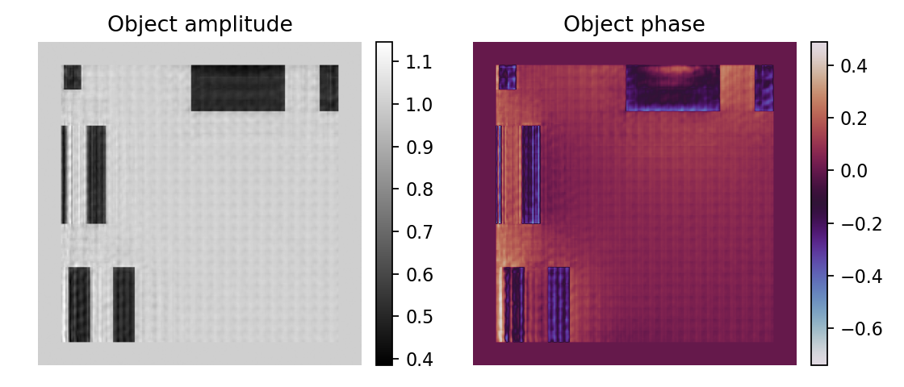

The saved baseline is used for post-reconstruction evaluation, not to initialize the other methods' objects or probes.

## Camera settings and correspondence to the paper

| Item | Setting | Source or explanation |
|---|---|---|
| Photon shot noise | Poisson distribution | Paper Eqs. (1)–(6) |
| Dark-current shot noise | Poisson distribution | Paper Eqs. (1)–(6) |
| Read noise | Zero-mean Gaussian distribution | Paper Eqs. (1)–(6) |
| Full-well capacity | 2.5×10⁶ electrons | Paper Section III-A |
| Photon flux | 10⁹ photons/s | Paper Section III-A; mapping to the local data is an additional assumption |
| ADC bit depth | 8 bit | Paper HDR comparison setting |
| Dark frames | 20 per exposure | Paper Sections III-A and IV |
| Exposure times | 0.5, 1, 5, 10, 50, 100, 500 ms | Transmission experiment in paper Fig. 5 |
| Dark-current rate | 80 e⁻/s | Assumption inherited from the earlier project; no numerical value is given in the paper |
| Read noise in the low-noise scenario | Standard deviation 5 e⁻ | Assumption inherited from the earlier project |
| Two sensitivity scenarios | Electron standard deviations equivalent to 0.25 and 1 ADC count | Explicit additional sensitivity analysis, not the dB values in paper Fig. 3 |

One global flux factor sets the brightest scan frame's total detected photon rate to 10⁹/s while preserving relative energies across scan positions. Quantum efficiency is assumed to be 1. The paper does not provide enough information to determine this mapping uniquely.

The fixed baseline uses 441 scan positions, 32×32 detector frames, and 80 iterations; these reconstruction settings are this project's own choices and differ from the paper's simulation. Parameter sources are in the [experiment configuration](../experiments/paper_baseline_comparison.json); runtime information and input hashes are in the [experiment manifest](experiment_manifest.json).

## Original paper equations and additional control

`paper_ml_hdr` follows the structure of paper Eqs. (14)–(15):

```text
r_bar = mean((Z_i - dark_mean_i) / t_i)
w_i   = t_i² / (t_i * r_bar + dark_variance_i)
HDR   = sum(w_i * (Z_i - dark_mean_i) / t_i) / sum(w_i)
```

The implementation includes nonnegativity and division-by-zero safeguards, without implicit saturation rejection. When dark-frame variance is zero and the denominators are valid, the expression reduces to total counts divided by total exposure time. Saturated counts still participate in the average and can underestimate bright regions.

`saturation_mask_extension` separately masks saturated observations and computes its initial rate using only unsaturated exposures. It retains zero-valued observations and explicitly reports failure if every exposure is saturated at any pixel. **This is an additional diagnostic control, not the paper's original algorithm.**

## Paper-style comparisons from saved results

The four figure sets below follow the multi-method layouts of paper Figs. 2 and 3 and use all 27 summary rows in [summary_metrics.csv](summary_metrics.csv): three noise scenarios × nine inputs, each with fixed camera seeds 0, 1, and 2, totaling 81 reconstructions. They regenerate existing results without running new reconstructions. Reconstruction seed is fixed at 0. Error bars or shading show **sample standard deviations**, not confidence intervals or evidence of statistical significance. Variability in reconstructed-amplitude metrics also includes known numerical-solver variation. Camera/fusion-stage diffraction error and saturation fractions are unaffected by reconstructor variability.

Regenerate from the repository root without the unavailable raw arrays or PtyLab:

```bash
python scripts/plot_paper_comparisons.py --source docs --output docs/figures/paper_comparisons
```

The output directory contains high-resolution PNG, vector SVG, and a [figures_manifest.json](figures/paper_comparisons/figures_manifest.json) provenance record. All curves and numerical values come from CSV. Original reconstruction images remain single-run snapshots below; quantitative metrics are not inferred from rendered PNG files.

The previous provenance audit confirmed 27 unique noise-scenario/input-method combinations in the CSV, with recorded run and success counts both totaling 81. The four figure sets' source-file and plotting-code hashes are recorded in their manifests. The [historical experiment manifest](experiment_manifest.json) preserves source records from experiment generation: three of seven source/configuration files matched the then-current files. `mlhdr_ptycho/ml_hdr.py` and `mlhdr_ptycho/paper_reproduction.py` had subsequent changes; `mlhdr_ptycho/ptylab_reconstruction.py` and `scripts/reproduce_paper.py` also received portability fixes for cache directories and report commands. These changes do not alter the saved summary metrics, and historical source records remain unchanged. Missing raw arrays were not recomputed; the 532 output-audit checks below are historical records.

### All exposure curves

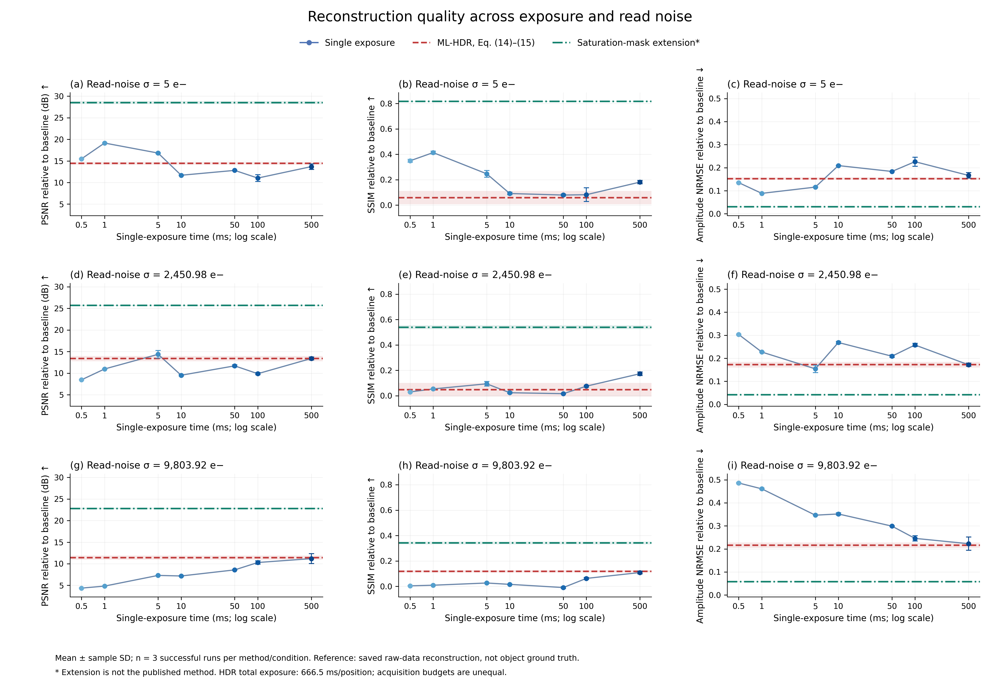

[Download vector SVG](figures/paper_comparisons/exposure_comparison.svg). Seven single exposures use a logarithmic exposure axis; the two multi-exposure fusion methods appear as horizontal mean and standard-deviation references. The axis represents only single-exposure time. Fusion uses all seven exposures with **666.5 ms total integration per position**, rather than an acquisition budget equal to any single exposure on the graph.

PSNR, SSIM, and amplitude NRMSE measure agreement with the saved raw-data reconstruction. NRMSE here is relative L2 error, **not the RMS metric in paper Fig. 2**. The 1 ms single exposure performs best in the low-noise scenario. At 0.25 ADC count read noise, 500 ms has the highest mean SSIM, but 5 ms has the highest mean PSNR. A best method selected using one metric cannot be assumed best under every metric.

### All-method heatmaps


[Download vector SVG](figures/paper_comparisons/method_heatmaps.svg). The heatmaps include all seven single exposures and both fusion outputs, with cells showing three-run means. Each metric has its own color scale; interpret numerical values and the direction of improvement rather than comparing colors across different metrics. Additional saturation masking improves amplitude agreement in all three scenarios, but it is neither the original paper algorithm nor LRFC-HDR.

### Noise sensitivity of fixed methods

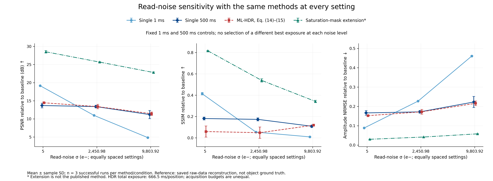

[Download vector SVG](figures/paper_comparisons/noise_comparison.svg). The fixed methods are **1 ms, 500 ms, original paper equations, and additional saturation masking**, without reselecting exposure by scenario. The three x-axis positions correspond to read-noise standard deviations of 5, 2450.98, and 9803.92 e⁻, approximately 0.00051, 0.25, and 1 ADC count. These are not the noise-dB values in paper Fig. 3. Connecting lines help visualize the three measured conditions and do not imply experiments at additional noise levels.

The original equations' mean SSIM is below the 500 ms single exposure at low and moderate noise and slightly above it at the highest read noise. The latter difference is comparable to repeat variation. These results do not support a consistent general advantage for the original equations.

### Diffraction error and saturation diagnostics

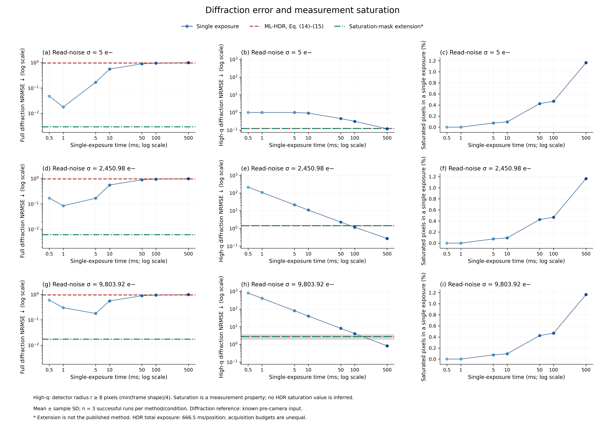

[Download vector SVG](figures/paper_comparisons/diffraction_diagnostics.svg). Diffraction NRMSE uses the **diffraction input before camera simulation** as its reference, restoring a common scale using the known camera gain. This reference differs from the reconstruction baseline used for object-amplitude metrics. The high-frequency region is defined by radial distance from the detector center, **r ≥ 8 px**. NRMSE can exceed 1; larger values indicate error greater than the signal norm in the corresponding reference region.

Additional saturation masking substantially reduces the recorded full-frequency diffraction error. However, the two fusion methods have almost identical high-frequency NRMSE: approximately 0.124, 1.421, and 2.739 at low, moderate, and high read noise. The saturation-handling gain therefore does not establish a corresponding high-frequency error improvement or prove improved real resolution.

The saturation fraction is the proportion of raw ADC pixels at the maximum count. Approximately 1.165% of pixels are saturated at 500 ms. Fusion outputs do not have a raw-measurement saturation fraction under this definition, so the third column displays only seven single exposures and does not treat missing values as zero. Both fusion methods remain in the first two error-comparison columns.

These figures do not include LRFC-HDR, bit-depth sweeps, object ground truth, FRC resolution, or additional phase comparisons. Existing files are insufficient to recompute those results, so this section regenerates only verifiable archived metrics.

## Single-run snapshots: all low-noise exposures

The images below use archived camera seed 0 to show artifacts and weak diffraction signals alongside the quantitative curves. They are not averages of three reconstructions. Amplitude comparisons use the baseline's shared scale, and diffraction images use a common log10 intensity scale.

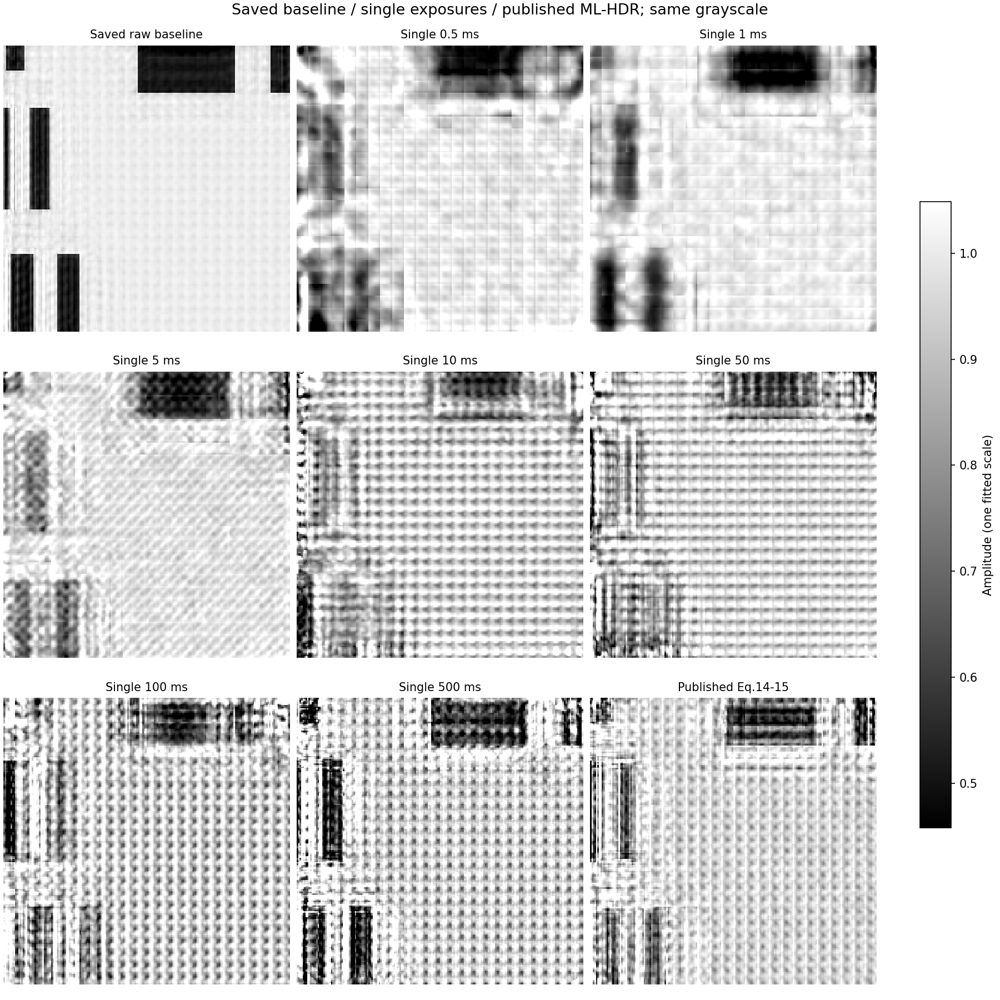


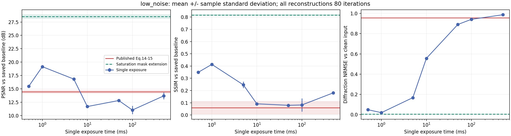

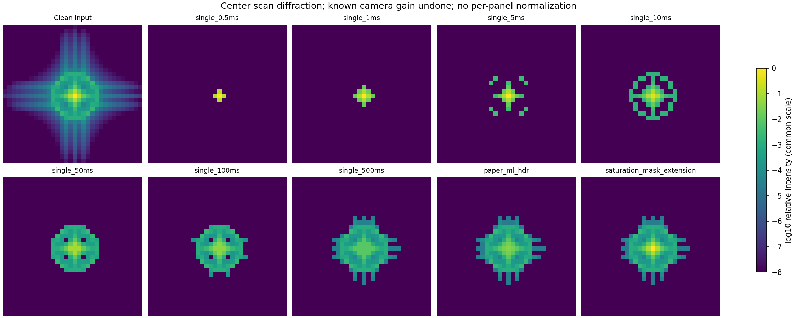

Original-equation fusion is affected by saturated counts from long exposures. Additional saturation handling brings bright-region counts closer to the input before camera simulation while using longer exposures to capture weak signals. This control supports a role for saturation handling in these data, but its improvement cannot be attributed to the original equations.

## Summary across three noise scenarios

Values are means across three fixed camera seeds. The best single exposure in each scenario is selected by mean SSIM. All exposures remain in the [complete metric table](summary_metrics.csv).

| Scenario | Best single exposure | Single-exposure SSIM | Original-equation SSIM | Saturation-extension SSIM |
|---|---|---:|---:|---:|
| `low_noise` | 1 ms | 0.4135 | 0.0589 | 0.8164 |
| `read_noise_025adu` | 500 ms | 0.1732 | 0.0482 | 0.5389 |
| `read_noise_1adu` | 500 ms | 0.1088 | 0.1187 | 0.3415 |

At high read noise, the original equations show a small mean improvement, comparable to repeat variability. Three seeds do not establish significance. At low and moderate read noise, the original equations do not beat the best single exposure, so a general advantage is not established.

### 0.25 ADC count read noise

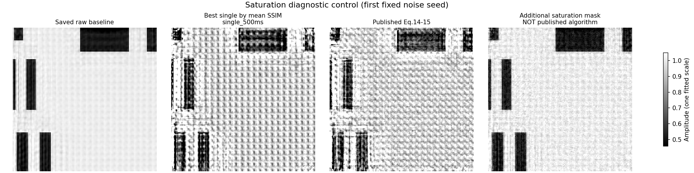

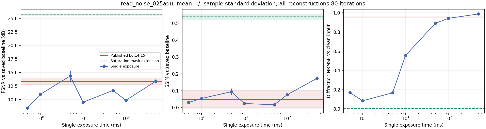

### 1 ADC count read noise


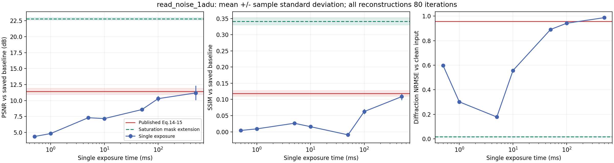

## Interpreting the comparisons

- PSNR and SSIM are referenced to the saved raw-data reconstruction, not object ground truth, and cannot be interpreted as real resolution improvement.
- Evaluation uses the same scan-coverage ROI and compensates only for one global amplitude factor. It does not apply translation, filtering, histogram matching, or method-specific grayscale stretching.
- Summary amplitude images use the baseline's common grayscale range. Separate baseline amplitude/phase images have their own colorbars.
- Diffraction NRMSE restores a common scale using known camera gain and compares against the input before camera simulation.
- Each method's fit error against its own input is a convergence diagnostic and cannot independently compare reconstruction quality across different inputs.
- All methods share the same camera measurements. Images show seed 0; statistics use all preset seeds 0, 1, and 2.
- Multi-exposure integration totals 666.5 ms per position, excluding dark frames and readout overhead. Acquisition times differ, so the comparison does not establish an efficiency advantage at equal photon budgets.

## Validation and repeatability

Nine independent scientific tests cover scalar equation examples, quantization boundaries, mixed-noise statistics, random repeatability, saturation behavior, metric scaling, and invalid input. The completed experiment passed 532 output-audit checks; see the [validation record](validation_record.json).

The audit confirmed unchanged original input and baseline, exactly reproducible measurement and fusion inputs, common reconstruction settings across methods, finite outputs for all 81 reconstructions with 80 iterations each, and agreement between metrics and saved arrays.

The historical baseline and its repeated reconstruction in the current environment have amplitude NRMSE 0.011393 and SSIM 0.950895. Additional repeated runs showed that the currently installed numerical reconstructor does not produce bit-identical outputs even with identical initial object/probe bytes and NumPy random sequences. The underlying cause remains unresolved. Cross-seed standard deviations for reconstructed-amplitude metrics therefore include numerical reconstruction variability. See [solver_repeatability.json](solver_repeatability.json).

Complete local validation depends on unavailable original data and binary outputs. The repository's validation JSON files are audit records of the completed experiment.

## Paper-style simulation comparisons

This section is independent of the fixed-baseline experiment above. It uses saved **full simulations with known ground truth** from `scripts/run_paper_style_simulation.py`. Figures follow paper Figs. 2, 3, 5, 6, and 7, and all metrics—PSNR, SSIM, NRMSE, FRC, and resolvable USAF elements—are referenced to **simulation ground truth**. Existing CSV/NPZ/JSON files were organized and replotted without rerunning simulations. Paper Figs. 6 and 7 show **real experiments**; the corresponding results here are simulations.

This is an adapted simulation designed around the paper's figure layouts. This project's own geometry choices (a 226×226 object, a 64×64 probe window and virtual detector with a 32 px probe diameter, and 8 px steps with 10% random perturbation) differ from the paper's simulation; it uses 20×20 scan positions and 250 iterations. It adopts the paper's experimental wavelength of 632.8 nm and distance of 13.9 mm. The paper does not fully specify simulation exposure timing, numerical read noise, and several implementation details; camera read noise, dark current, noise-dB definitions, and simulation exposure scheduling use explicit project assumptions. Geometry, camera models, and evaluation are not identical, so absolute values cannot be interpreted as a point-for-point reproduction of the paper's experiment.

All figures use the same encoding for four methods:

| Method | Meaning | Color / line style |
|---|---|---|
| `single` | Longest of seven exposures whose noiseless peak is unsaturated, fixed for each object | Black solid line, circles |
| `lrfc` | LRFC-HDR control following the linear-response relationship in paper Eqs. (16)–(17); choosing the longest unsaturated exposure per pixel is a project implementation choice | Blue dash-dot line, diamonds |
| `ml_eq14_15` | Paper Eqs. (14)–(15), with nonnegativity and division-by-zero safeguards; saturated pixels participate in fusion | Red dotted line, squares |
| `ml_masked` | Eqs. (14)–(15) weights with saturated observations excluded; **a project extension, not the paper's algorithm** | Green dash-dot line, triangles |

Regenerate from existing full results:

```bash
python scripts/plot_paper_style_figures.py --source outputs/paper_style/full --output docs/figures/paper_style --summary-csv docs/paper_style/summary.csv --copy-data-to docs/paper_style/data
```

Provenance and hashes are in [figures_manifest.json](figures/paper_style/figures_manifest.json), key values in [summary.md](paper_style/summary.md) / [summary.csv](paper_style/summary.csv), and CSV/JSON input copies in [paper_style/data/](paper_style/data/). The figures and tables compare this project's four methods with each other; they contain no values taken from the paper.

Saved full data contain 120 bit-depth records and 108 noise records, all with status `ok`, using seeds 0, 1, and 2. Sweep curves show three-run means ± sample standard deviations. USAF images, line profiles, FRC, and convergence plots use single-run arrays from seed 0. These runs are counted separately from the 81 fixed-baseline reconstructions above.

### Figure 2 counterpart: ADC bit-depth sweep

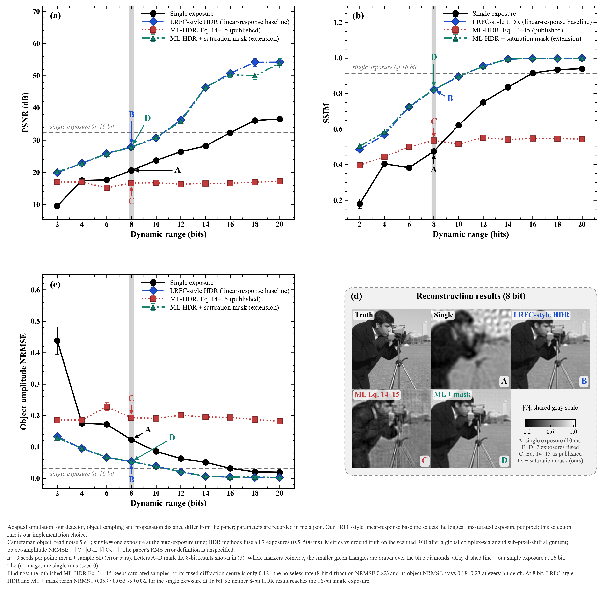

[Download vector SVG](figures/paper_style/fig2_bit_depth.svg). The cameraman object uses 5 e⁻ read noise and 2–20-bit depths. Panels (a)–(c) show means ± sample standard deviations. A gray vertical line marks 8 bit; A–D indicate the 8-bit results in (d). Gray dashed lines show this project's 16-bit single-exposure values. Amplitude error is this project's object-amplitude NRMSE (the paper does not define its RMS error).

At 8 bit, mean PSNR for single exposure, LRFC-HDR, original paper equations, and the saturation-masking extension is **20.56, 27.88, 16.65, and 27.82 dB**; mean SSIM is **0.4747, 0.8214, 0.5355, and 0.8222**. The 16-bit single-exposure reference is **32.31 dB / 0.9152**. None of the 8-bit methods reaches this reference: relative to it, the original equations differ by **−15.66 dB** and LRFC and the extension by **−4.43 and −4.49 dB** in PSNR.

The original equations retain saturated observations, giving mean 8-bit diffraction NRMSE of approximately **0.8201**, far above LRFC's **0.00339** and the extension's **0.00375**. Increasing ADC bit depth cannot recover bright-region counts lost to full-well saturation. Original-equation object NRMSE is approximately 0.18–0.23 in this sweep. Rankings differ by metric; higher SSIM does not necessarily imply lower NRMSE.

### Figure 3 counterpart: noise sweep

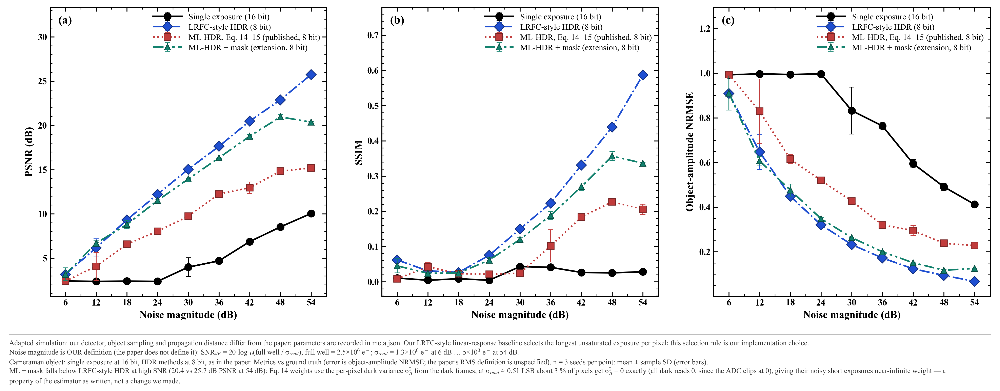

[Download vector SVG](figures/paper_style/fig3_noise.svg). The paper does not define its noise level in dB. This project defines SNR_dB = 20·log₁₀(full_well / σ_read), with full well 2.5×10⁶ e⁻. Thus, 6 dB and 54 dB correspond to σ_read ≈ 1.25×10⁶ e⁻ and ≈ 5.0×10³ e⁻, respectively. As in the paper, single exposure uses 16 bit and the three HDR methods use 8 bit.

Under this definition, higher x-axis dB means lower read noise. Overall PSNR improves as noise decreases. At 54 dB, the means for LRFC, the extension, original equations, and 16-bit single exposure are **25.74, 20.37, 15.19, and 10.05 dB**, with SSIM **0.5870, 0.3366, 0.2055, and 0.0284**. The original equations have lower PSNR and higher NRMSE than LRFC at every noise setting.

The extension is below LRFC at high dB, and its SSIM does not continue improving between 48 and 54 dB. Saturation masking does not guarantee improvement for every noise setting.

### Figure 5 counterpart: multi-exposure diffraction images

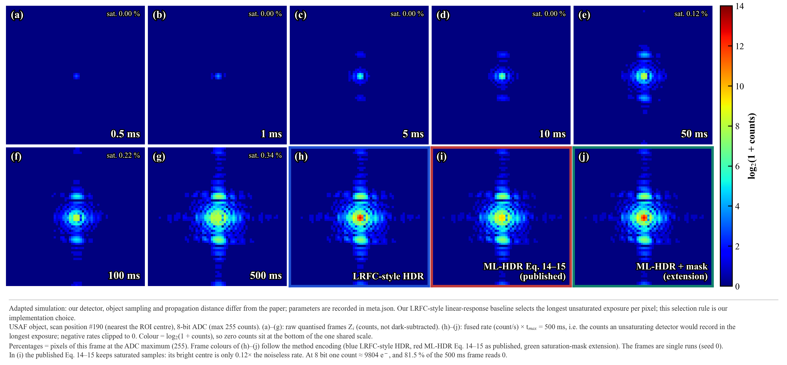

[Download vector SVG](figures/paper_style/fig5_diffraction.svg). The USAF object is shown at one scan position near the ROI center, using an 8-bit ADC. Panels (a)–(g) show quantized raw counts. Panels (h)–(j) multiply fused rates (count/s) by the longest exposure, 500 ms, to show equivalent counts for an unsaturated detector integrating for 500 ms. All ten panels share one log₂(1 + counts) color scale.

For this displayed frame, saturation is **0%** at 0.5, 1, 5, and 10 ms, and **0.1221%, 0.2197%, and 0.3418%** at 50, 100, and 500 ms. These percentages are the frame-level fractions in `meta.json` multiplied by 100. They describe this one scan position, separately from the full-measurement statistics in the fixed-baseline section. The original equations retain long-exposure saturated counts at the bright center, giving a fused rate below the known noiseless reference. LRFC and the extension show a stronger central signal. The shared color scale permits HDR equivalent counts above the original 8-bit ADC limit of 255.

### Figure 6 counterpart: 8-bit USAF resolution

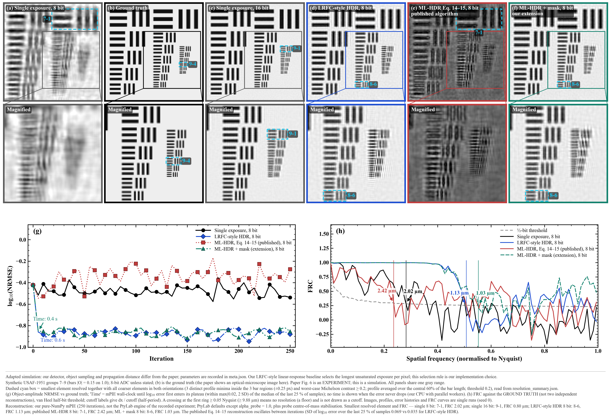

[Download vector SVG](figures/paper_style/fig6_usaf_8bit.svg). Panel (b) is simulation ground truth; the paper uses an optical microscope image at this position. Cyan dashed boxes mark the smallest element resolvable in both orientations along with every coarser element, read directly from `resolution_summary.json`. Panel (g) shows logarithmic object-amplitude NRMSE versus iteration. “Time” is the mPIE wall-clock time when error first enters the plateau region. Panel (h) uses **ground-truth-referenced FRC** (reconstruction against the known simulation ground truth).

For seed 0, the ground-truth FRC half-period resolutions of 8-bit single exposure, LRFC, original equations, and the extension are **2.025, 1.125, 2.420, and 1.034 μm**. Their smallest continuously resolvable elements are **G7 E1, G8 E6, G7 E1, and G8 E6**. The 16-bit single-exposure reference is **0.799 μm / G9 E1**. FRC cutoff and stripe resolvability measure different properties and are not interchangeable.

LRFC and the extension first meet the plateau rule at **0.572 s and 0.447 s**, both at iteration 5. Complete 250-iteration reconstruction takes approximately 27.6 s and 24.1 s, respectively. Single exposure and the original equations do not meet the required error-reduction threshold, so no plateau time is reported. The original-equation error curve oscillates across iterations. Plateau times depend on the project's criterion and local runtime; they are not total algorithm runtimes.

### Figure 7 counterpart: 16-bit USAF and line profiles

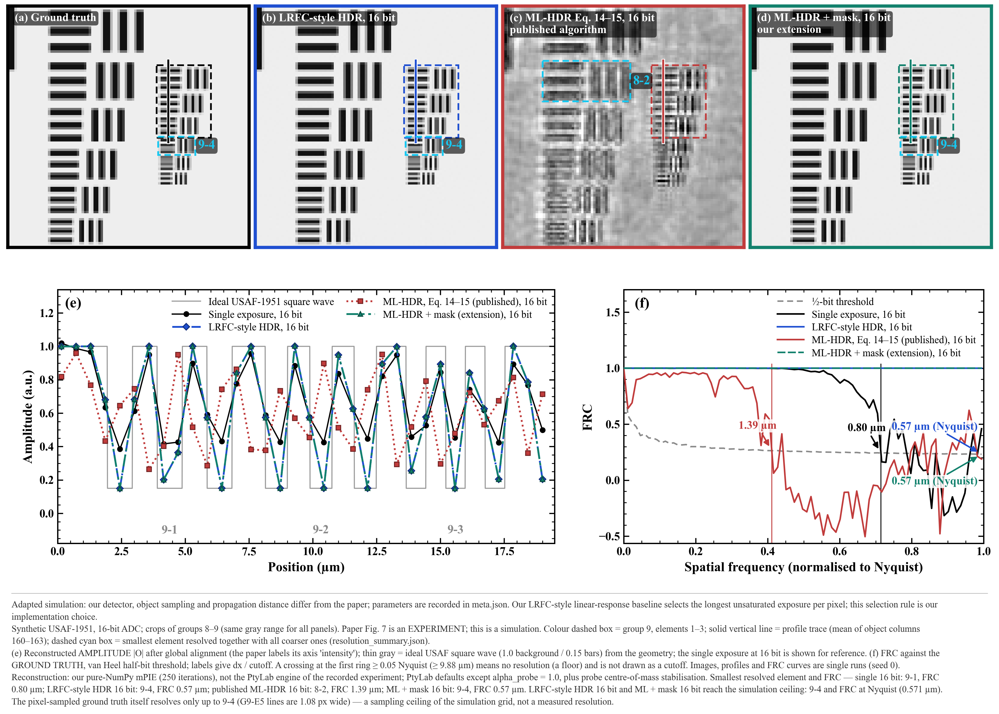

[Download vector SVG](figures/paper_style/fig7_usaf_16bit.svg). Panel (e) shows **amplitude** profiles along a vertical line through horizontal bars in group 9, elements 1–3; the paper labels its axis as intensity. The thin gray line is an ideal USAF square wave generated from geometry.

For seed 0, both 16-bit LRFC and the extension reach **G9 E4 (0.691 μm line width)**. Their ground-truth FRC cutoff reaches Nyquist (**0.571 μm**), the simulation's sampling limit. The original equations give **G8 E2 / 1.388 μm**, and 16-bit single exposure gives **G9 E1 / 0.799 μm**. The pixel-sampled ground truth itself is continuously resolvable only through G9 E4, so 0.571 μm cannot be treated as verified real-instrument resolution.

In G9 E1–E3 amplitude profiles, LRFC and the extension approach the geometrical ground-truth high/low levels, while single exposure has higher minima. The original equations show uneven stripe responses. These are aligned amplitudes, not intensities.

### Assumptions and limitations

- Project-selected simulation parameters are wavelength 632.8 nm, distance 13.9 mm, a 64×64 virtual detector (0.571 μm object-plane pixels, matching the paper's experiment), photon flux 10⁹ photons/s as the brightest diffraction frame's total rate, full well 2.5×10⁶ e⁻, dark current 80 e⁻/s, 20 dark frames per exposure, base read noise 5 e⁻, and seven exposures from 0.5 to 500 ms. All values are in [meta.json](paper_style/data/meta.json).
- Reconstruction uses this project's pure NumPy mPIE, without PtyLab installed, with `alpha_probe = 1.0`, Fraunhofer propagation, and integer-pixel scan positions.
- All metrics use known ground truth after alignment by one global complex factor and subpixel translation. FRC compares reconstruction with ground truth using the van Heel half-bit threshold. Half-period resolution = pixel size / cutoff frequency. Nyquist cutoffs are limited by pixel size.
- USAF resolvability requires a clear minimum in each of three stripe regions and a worst-case Michelson contrast ≥ 0.2. The reported smallest element must be resolvable in both orientations along with all coarser elements.
- Noise-dB definitions, automatic single-exposure selection, and the convergence plateau rule are project definitions. Convergence times are local wall-clock times under multiprocessing.
- Sweep curves show multiple-seed means ± sample standard deviations. Images, profiles, convergence, and FRC curves show one run with the first seed.

## Reference

Liu et al., *Resolution-Enhanced Lensless Ptychographic Microscope Based on Maximum-Likelihood High-Dynamic-Range Image Fusion*, IEEE Transactions on Instrumentation and Measurement, 2024. [DOI: 10.1109/TIM.2024.3363788](https://doi.org/10.1109/TIM.2024.3363788).
