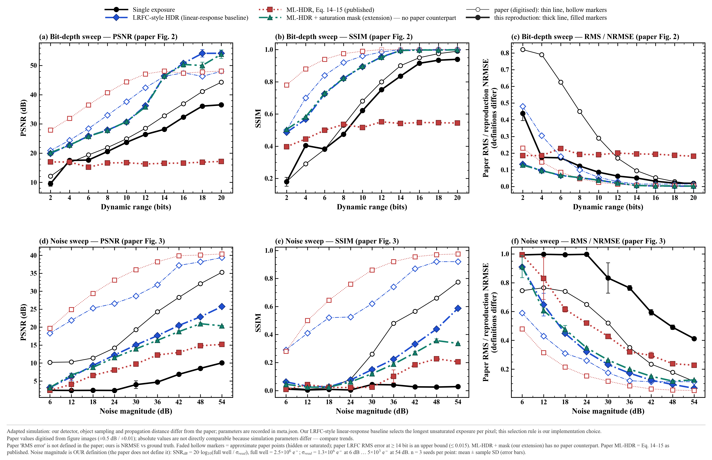

# 固定基线的 ML-HDR 对照实验

本页整理已经完成的 81 次重建：三个噪声场景 × 三个相机种子 × 九种输入（七档单曝光、论文原式融合、附加饱和屏蔽扩展）。所有重建固定为 80 次 mPIE 迭代。

历史固定基线图和指标是已有实验的发布快照；该实验的原始数据、测量帧及完整重建数组在本次工作目录中已缺失。下文论文风格仿真的 full / quick 数据则已完整纳入仓库，包含真值、代表重建复数组、收敛、FRC、USAF 和衍射示例，可在新设备直接重绘和继续分析。恢复步骤及数据完整性检查见[换设备恢复说明](REPOSITORY_RESTORE.md)。

另有一组以已知真值为参考的新仿真，按论文图 2、3、5、6、7 的版式绘制，见文末[论文风格仿真对比图](#论文风格仿真对比图)。

## 基线

基线使用原始 `diff.npy` 的中心 `21×21` 扫描、`32×32` 探测器帧、8 px 扫描步长、31 px 初始探针直径、`circ_smooth` / `ones` 初始化。原始存档为 `outputs/sweep_21x21_steps8_14_i80/best/best_reconstruction.npz`。


保存的基线用于事后评价，没有作为其他方法的物体或探针初始化。

## 相机设置与论文对应关系

| 项目 | 设置 | 来源或说明 |
|---|---|---|
| 光子散粒噪声 | 泊松分布 | 论文式（1）—（6） |
| 暗电流散粒噪声 | 泊松分布 | 论文式（1）—（6） |
| 读出噪声 | 零均值高斯分布 | 论文式（1）—（6） |
| 满阱容量 | 2.5×10⁶ 电子 | 论文 III-A |
| 光通量 | 10⁹ photons/s | 论文 III-A；映射到当前数据是补充假设 |
| ADC 位深 | 8 bit | 论文的 HDR 对照设置 |
| 暗场数量 | 每档 20 张 | 论文 III-A、IV |
| 曝光时间 | 0.5、1、5、10、50、100、500 ms | 论文图 5 的透射实验 |
| 暗电流强度 | 80 e⁻/s | 继承旧项目的假设，论文未给出具体数值 |
| 低噪声场景的读出噪声 | 标准差 5 e⁻ | 继承旧项目的假设 |
| 两个敏感性场景 | 标准差 0.25、1 ADC count 对应的电子数 | 明确添加的敏感性分析，并非原文图 3 的 dB 取值 |

光通量使用一个全局系数，使最亮扫描帧的总探测光子率为 10⁹/s，同时保持扫描位置之间的相对能量；量子效率假设为 1。论文没有提供足够信息唯一确定这个映射。

与论文原始仿真不同，本项目按固定基线使用 441 个扫描位置、32×32 探测器帧和 80 次迭代；原文仿真使用 400 个位置、256×256 探测器帧和 250 次迭代。参数来源见 [实验配置](../experiments/paper_baseline_comparison.json)，实际运行环境和输入哈希见 [实验清单](experiment_manifest.json)。

## 严格论文公式与附加对照

`paper_ml_hdr` 采用论文式（14）—（15）的结构：

```text
r_bar = mean((Z_i - dark_mean_i) / t_i)
w_i   = t_i² / (t_i * r_bar + dark_variance_i)
HDR   = sum(w_i * (Z_i - dark_mean_i) / t_i) / sum(w_i)
```

实现包含非负约束和除零保护，没有隐藏的饱和剔除。当暗场方差为零且分母有效时，上式退化为总计数除以总曝光时间。饱和计数仍参与平均，因此可能低估亮区。

`saturation_mask_extension` 单独屏蔽饱和观测，初始率也仅使用未饱和曝光计算。它保留零值观测；如果某像素所有曝光都饱和，则明确报告失败。**这是额外的诊断对照，不是论文原算法。**

## 论文式综合对比（已有结果重绘）

以下四组图参考论文图 2、图 3 的多方法比较方式，使用 [summary_metrics.csv](summary_metrics.csv) 中的全部 27 行汇总指标：三个噪声场景 × 九种输入，每组包含三个固定相机种子 0、1、2，共 81 次重建。它们是既有实验的重新绘图，没有运行新重建。重建种子固定为 0；误差条或阴影表示三次结果的**样本标准差**，不是置信区间，也不能用来证明统计显著性。重建振幅指标的波动还包含已知的数值求解波动；相机与融合阶段的衍射误差、饱和比例不受重建器波动影响。

在仓库根目录运行以下命令即可重绘，不需要未归档的原始数组或 PtyLab：

```bash
python scripts/plot_paper_comparisons.py --source docs --output docs/figures/paper_comparisons
```

输出目录同时保存高清 PNG、矢量 SVG 和 [figures_manifest.json](figures/paper_comparisons/figures_manifest.json) 来源清单。所有曲线和数值均来自 CSV；原始重建图保留为下方的单次快照，不从渲染后的 PNG 反推定量指标。

本次来源核对确认：CSV 含 27 个不重复的“噪声场景 × 输入方法”组合，记录的运行数与成功数合计均为 81；四组图的来源文件和绘图源码哈希与其图表清单一致。[历史实验清单](experiment_manifest.json) 保留生成实验时的源码记录：其中 7 个源码或配置文件有 3 个与当前文件一致；`mlhdr_ptycho/ml_hdr.py` 和 `mlhdr_ptycho/paper_reproduction.py` 已有后续修改，`mlhdr_ptycho/ptylab_reconstruction.py` 与 `scripts/reproduce_paper.py` 本次另修复了跨系统缓存目录和报告命令。这不改变已保存的汇总指标；历史源码记录按原样保留。本次未复算缺失的原始数组，下文的 532 项产物审计属于历史记录。

### 全曝光曲线


[下载矢量 SVG](figures/paper_comparisons/exposure_comparison.svg)。七档单曝光以对数曝光轴展示，两种多曝光融合方法以各自的均值和标准差作为水平对照。横轴只代表单曝光时间；融合使用全部七档，总积分时间为 **666.5 ms/位置**，不是图上任一单曝光的同等采集预算。

PSNR、SSIM 和振幅 NRMSE 都以保存的原始数据重建为参考，衡量与该基线的一致性。这里的 NRMSE 是相对 L2 误差，**不是论文图 2 的 RMS 指标**。低噪声场景中 1 ms 的单曝光表现最好；在 0.25 ADC count 场景中，最高平均 SSIM 来自 500 ms，最高平均 PSNR 却来自 5 ms，不能把某一指标选出的“最佳”推广到所有指标。

### 全方法热力图


[下载矢量 SVG](figures/paper_comparisons/method_heatmaps.svg)。热力图同时保留七档单曝光与两种融合结果，单元格数值为三次均值。各指标独立使用色标，应按其数值和优劣方向阅读，不能横跨不同指标比较颜色。额外饱和屏蔽的振幅一致性在三个场景下均更高，但它不属于论文原算法，也不是 LRFC-HDR。

### 固定方法的噪声敏感性


[下载矢量 SVG](figures/paper_comparisons/noise_comparison.svg)。固定比较 **1 ms、500 ms、论文原式和额外饱和屏蔽**，不随噪声场景重新挑选曝光。三个横轴位置对应实际读出噪声标准差 5、2450.98、9803.92 e⁻，分别约为 0.00051、0.25、1 ADC count；它们不是论文图 3 的噪声 dB 取值。连接线只帮助观察这三个已测条件，不代表更多噪声条件的实验结果。

论文原式的平均 SSIM 在低、中噪声下均低于 500 ms 单曝光，在最高读出噪声下略高于它；后者差异与重复波动相近。这些结果不支持论文原式具有稳定的普遍优势。

### 衍射误差与饱和诊断


[下载矢量 SVG](figures/paper_comparisons/diffraction_diagnostics.svg)。衍射 NRMSE 以**相机模拟前的衍射输入**为参考，并按已知相机增益恢复共同尺度；这一参考与物体振幅指标的重建基线不同。高频区域按探测器中心径向距离 **r ≥ 8 px** 定义。NRMSE 可以大于 1，较大的数值表示误差超过对应参考区域的信号范数。

额外饱和屏蔽大幅降低了已记录的全频衍射误差，但两种融合方法的高频 NRMSE 几乎相同：低、中、高读出噪声下分别约为 0.124、1.421、2.739。这说明当前饱和处理的收益不能直接解释为高频误差也同步改善，更不能作为真实分辨率提升的证明。

饱和比例统计的是原始 ADC 测量中等于上限的像素比例。500 ms 单曝光约有 1.165% 的像素饱和；融合输出没有同一定义的饱和测量比例，所以该列只画七档单曝光，不把缺失值当成零。两种融合方法仍显示在前两列误差对照中。

本组图未包含论文中的 LRFC-HDR、位深扫描、真值物体、FRC 分辨率或新增相位对比。现有文件不足以复算这些结果，因此这里只重绘可核对的已归档指标。

## 单次图像快照：低噪声全部曝光对比

下列图像来自已归档的相机种子 0，帮助对照定量曲线中的伪影和弱衍射信息；它们不是三次重建的平均图。振幅比较采用基线的共同色阶，衍射图采用共同的 log10 强度色阶。


原式融合受到长曝光饱和计数影响。附加饱和处理使亮区计数更接近相机模拟前的输入，同时利用较长曝光记录弱信号。此对照支持饱和处理在本数据上的作用，但不能据此将改善归于论文原式。

## 三个噪声场景的汇总

以下为三个固定相机种子的平均值。每个场景的“最佳单曝光”按平均 SSIM 选择；所有曝光均保留在 [完整指标表](summary_metrics.csv) 中。

| 场景 | 最佳单曝光 | 单曝光 SSIM | 论文原式 SSIM | 饱和屏蔽扩展 SSIM |
|---|---|---:|---:|---:|
| `low_noise` | 1 ms | 0.4135 | 0.0589 | 0.8164 |
| `read_noise_025adu` | 500 ms | 0.1732 | 0.0482 | 0.5389 |
| `read_noise_1adu` | 500 ms | 0.1088 | 0.1187 | 0.3415 |

高读出噪声场景中，原式出现小幅平均提升，但幅度与重复实验波动相近，三个种子不足以证明显著性。低噪声与中等读出噪声场景中，原式未优于最佳单曝光，因此没有证实原式具有普遍优势。

### 0.25 ADC count 读出噪声


### 1 ADC count 读出噪声


## 如何解释这些比较

- PSNR 和 SSIM 参考的是保存的原始数据重建，而不是物体真值，不能解释为真实分辨率提升。
- 统一评价扫描覆盖 ROI；仅补偿一个整体振幅比例。没有平移、滤波、直方图匹配或按方法单独拉伸灰度。
- 汇总振幅图使用基线的共同灰度范围；原始基线的独立振幅/相位图带有各自色条。
- 衍射 NRMSE 使用已知相机增益还原共同尺度，再与模拟相机之前的输入比较。
- 各方法对自身输入的拟合误差仅作为收敛诊断，不能单独用于跨输入评价重建质量。
- 所有方法共享同一份相机测量。图像固定展示种子 0，统计使用全部预设种子 0、1、2。
- 多曝光总积分时间为 666.5 ms/位置，不含暗场及读出开销；这是不同采集时间的比较，不代表相同光子预算下的效率优势。

## 验证与重复性

9 项独立科学测试覆盖公式标量例子、量化边界、混合噪声统计、随机重复性、饱和行为、指标尺度和无效输入。已完成实验通过 532 项产物审计，细节见 [验证记录](validation_record.json)。

审计确认原始输入及基线没有被改动、测量和融合输入能精确重现、每种方法采用相同重建配置、全部 81 个重建结果为有限值且包含 80 次迭代，以及指标与保存数组一致。

历史基线与当前环境复算结果的振幅 NRMSE 为 0.011393，SSIM 为 0.950895。进一步重复运行显示：即使初始物体/探针字节和 NumPy 随机序列一致，当前安装的数值重建器输出仍不逐位相同，底层原因尚未定位。因此重建振幅指标的跨种子标准差也包含数值重建的重复波动。记录见 [solver_repeatability.json](solver_repeatability.json)。

完整本地验证依赖未公开的原始数据与二进制结果；仓库内的验证 JSON 是已完成实验的审计记录。

## 论文风格仿真对比图

本节与上文的固定基线实验相互独立：数据来自 `scripts/run_paper_style_simulation.py` 已保存的 **full 已知真值仿真**，图像按论文图 2、3、5、6、7 的版式绘制，所有指标（PSNR、SSIM、NRMSE、FRC、USAF 可分辨元素）都以**仿真真值**为参考。本次续作读取既有 CSV / NPZ / JSON 整理与重绘，没有重新执行仿真。论文图 6、图 7 是**真实实验**结果，这里对应的是仿真。

这是按论文图式设计的改编仿真。论文报告了 1024×1024 物体、256×256 探针与探测器、20×20 个扫描位置、约 40 px 步长及 10% 随机扰动、50 mm 传播距离和 250 次迭代。本项目保留 20×20 个位置与 250 次迭代，使用 226×226 物体、64×64 探针窗口与虚拟探测器（探针直径 32 px）、8 px 步长及 10% 扰动，并借用论文实验的 632.8 nm 波长与 13.9 mm 距离。论文未充分说明仿真曝光时序、读出噪声数值及若干实施细节；相机读出噪声、暗电流、噪声 dB 定义及仿真曝光安排采用本项目明确记录的假设。几何、相机和评价方式并不完全一致，绝对数值不能解释为原论文实验的逐点复现。

四种方法在所有图中使用同一编码：

| 方法 | 含义 | 颜色 / 线型 |
|---|---|---|
| `single` | 单曝光：7 档中无噪声峰值不饱和的最长曝光，对每个物体固定 | 黑色实线、圆点 |
| `lrfc` | 按论文式（16）—（17）的线性响应关系构建的 LRFC-HDR 对照；逐像素取最长未饱和曝光是本项目的实施选择 | 蓝色点划线、菱形 |
| `ml_eq14_15` | 按论文式（14）—（15）实现，含非负与除零保护；饱和像素参与融合 | 红色点线、方块 |
| `ml_masked` | 式（14）—（15）权重并剔除饱和观测——**本项目扩展，不是论文算法** | 绿色点划线、三角 |

从已有 full 结果重绘：

```bash
python scripts/plot_paper_style_figures.py --source outputs/paper_style/full --output docs/figures/paper_style --summary-csv docs/paper_style/summary.csv --copy-data-to docs/paper_style/data
```

来源与哈希见 [figures_manifest.json](figures/paper_style/figures_manifest.json)，关键数值见 [summary.md](paper_style/summary.md) / [summary.csv](paper_style/summary.csv)，所用 CSV / JSON 数据复制在 [paper_style/data/](paper_style/data/)。论文曲线数值来自人工数字化的 [paper_digitized.json](paper_style/paper_digitized.json)。

保存的 full 数据含 120 条位深扫描记录和 108 条噪声扫描记录，全部状态为 `ok`，种子为 0、1、2；图中扫描曲线为三次均值 ± 样本标准差。USAF 图像、线剖面、FRC 和收敛图使用种子 0 的单次数组。它们与上文固定基线的 81 次重建分别统计。

### 图 2 对应：ADC 位深扫描


[下载矢量 SVG](figures/paper_style/fig2_bit_depth.svg)。cameraman 物体，读出噪声 5 e⁻，位深 2–20 bit。(a)–(c) 为均值 ± 样本标准差；灰色竖线标出 8 bit，字母 A–D 指向 (d) 中展示的 8 bit 结果；灰色虚线为本项目单曝光在 16 bit 的数值。本项目误差定义为振幅 NRMSE；论文没有明确其 RMS 误差定义，两者不能数值等同。

8 bit 时，单曝光、LRFC-HDR、论文原式与饱和屏蔽扩展的平均 PSNR 分别为 **20.56、27.88、16.65、27.82 dB**，平均 SSIM 为 **0.4747、0.8214、0.5355、0.8222**。16 bit 单曝光参考为 **32.31 dB / 0.9152**；因此本项目未重现“8 bit ML-HDR 达到或优于 16 bit 单曝光”的结果，LRFC 与扩展也低于此参考。

论文原式保留饱和观测，其 8 bit 衍射 NRMSE 平均约 **0.8201**，远高于 LRFC 的 **0.00339** 和扩展的 **0.00375**；提高 ADC 位深并不能恢复因满阱饱和丢失的亮区计数。论文原式的物体 NRMSE 在此位深扫描中约为 0.18–0.23。各指标的排序存在差异，不能把较高 SSIM 直接等同于较低 NRMSE。

### 图 3 对应：噪声扫描


[下载矢量 SVG](figures/paper_style/fig3_noise.svg)。论文没有定义"噪声量级（dB）"。本项目定义为 SNR_dB = 20·log₁₀(满阱 / σ_read)，满阱 2.5×10⁶ e⁻，因此 6 dB 与 54 dB 分别对应 σ_read ≈ 1.25×10⁶ e⁻ 与 ≈ 5.0×10³ e⁻；单曝光为 16 bit，三种 HDR 方法为 8 bit，与论文相同。

按本项目定义，横轴 dB 越高，读出噪声越小。整体 PSNR 随噪声减小而提高；54 dB 时，LRFC、扩展、论文原式与 16 bit 单曝光的均值依次为 **25.74、20.37、15.19、10.05 dB**，SSIM 依次为 **0.5870、0.3366、0.2055、0.0284**。论文原式没有重现论文图 3 中对 LRFC 的优势。

扩展在高 dB 区域低于 LRFC，且 SSIM 在 48–54 dB 之间未继续提高；屏蔽饱和观测并不保证全部噪声设置下都改善结果。此处 dB 定义与论文没有明确对应关系，不能按同一横轴数值比较绝对性能。

### 图 5 对应：多曝光衍射图


[下载矢量 SVG](figures/paper_style/fig5_diffraction.svg)。USAF 物体、靠近 ROI 中心的一个扫描位置、8 bit ADC。(a)–(g) 为量化后的原始计数；(h)–(j) 把融合速率（count/s）乘以最长曝光 500 ms，换算成不饱和探测器在 500 ms 内的等效计数，十幅图共用一个 log₂(1 + counts) 色标。

当前展示帧在 0.5、1、5、10 ms 的饱和比例均为 **0%**，50、100、500 ms 分别为 **0.1221%、0.2197%、0.3418%**，来自 `meta.json` 中的帧级比例乘以 100。该比例描述这一扫描位置，与上文固定基线的全测量统计不同。论文原式在亮中心保留了长曝光的饱和计数，融合率低于已知无噪声参考；LRFC 和扩展的中心信号更强。所有面板共用色标，HDR 等效计数可超过原始 8 bit ADC 的 255 上限。

### 图 6 对应：8 bit USAF 分辨率


[下载矢量 SVG](figures/paper_style/fig6_usaf_8bit.svg)。(b) 为仿真真值（论文此处为光学显微镜图像）。青色虚线框标出与所有更粗元素一起在两个方向上均可分辨的最小元素，判定直接读取 `resolution_summary.json`。(g) 为物体振幅 NRMSE 对数随迭代的变化，"Time"为误差首次进入平台区的 mPIE 墙钟时间；(h) 本项目采用**真值参考 FRC**，与论文实验评价不能直接等同；论文没有说明足以确认其 FRC 输入实现的细节。

种子 0 的 8 bit 单曝光、LRFC、论文原式与扩展的真值参考 FRC 半周期分辨率分别为 **2.025、1.125、2.420、1.034 μm**，最小连续可分辨元素分别为 **G7 E1、G8 E6、G7 E1、G8 E6**。图中的 16 bit 单曝光参考为 **0.799 μm / G9 E1**。FRC 截止与条纹可分辨判定衡量不同性质，不能互换。

LRFC 和扩展在平台规则下首次达标的时间为 **0.572 s、0.447 s**（均在第 5 次迭代）；其完整 250 次重建分别耗时约 27.6 s、24.1 s。单曝光和论文原式未满足误差下降门槛，未报告平台时间。论文原式误差曲线存在迭代振荡。平台时间是本项目规则及本机运行数据，不等于算法总耗时，也不能与论文的 225 s / 360 s 比较。

### 图 7 对应：16 bit USAF 与线剖面


[下载矢量 SVG](figures/paper_style/fig7_usaf_16bit.svg)。(e) 为沿竖直线穿过第 9 组 1–3 号横条的**振幅**剖面（论文坐标轴标为强度），细灰线为由几何生成的理想 USAF 方波。

种子 0 的 16 bit LRFC 和扩展均达到 **G9 E4（线宽 0.691 μm）**，真值参考 FRC 截止达到奈奎斯特（**0.571 μm**），属于仿真采样上限。论文原式为 **G8 E2 / 1.388 μm**；16 bit 单曝光参考为 **G9 E1 / 0.799 μm**。真值经过像素采样后本身也只连续分辨到 G9 E4，因此不能把 0.571 μm 当作真实仪器已验证的分辨率。

G9 E1–E3 的振幅剖面中，LRFC 与扩展接近几何真值的高低电平，单曝光谷值更高；论文原式的条纹响应存在不均匀变化。图中展示的是对齐后的振幅，不能将这些纵轴数值直接当作论文的强度对比度。

### 与论文数字化曲线的叠加



[下载矢量 SVG](figures/paper_style/paper_vs_reproduction.svg)。细线空心点为论文图 2、图 3 的数字化数值（精度约 ±0.5 dB / ±0.01，半透明点为被遮挡或饱和的近似读数），粗线实心点为本项目。饱和屏蔽扩展没有论文对应曲线。

位深增加后单曝光和 LRFC 的质量总体提高，与论文趋势相近；论文原式在本项目中长期受饱和影响，没有重现论文图 2、图 3 中的领先排序。论文数字化的 8 bit ML-HDR 与 16 bit 单曝光 PSNR 差约 **+3.5 dB**，本项目为 **−15.66 dB**。这表示当前参数和实现下没有重现该比较结论，不表示已经定位了全部差异来源。

叠加图中的论文 RMS 定义未明确，项目 NRMSE 的定义已记录；两条误差曲线只适合观察形状和相对关系。噪声横轴的项目定义、物体采样与相机假设也不同。论文点的数字化误差和近似标记保留在源 JSON 中，绿色扩展没有论文对应方法。

### 假设与限制

- 仿真参数为本项目选择：波长 632.8 nm、距离 13.9 mm、64×64 虚拟探测器（物面像素 0.571 μm，与论文实验一致），光通量 10⁹ photons/s（最亮衍射帧总速率），满阱 2.5×10⁶ e⁻，暗电流 80 e⁻/s，每档 20 张暗场，基础读出噪声 5 e⁻，7 档曝光 0.5–500 ms。全部数值记录在 [meta.json](paper_style/data/meta.json)。
- 重建器为本项目的纯 NumPy mPIE（未安装 PtyLab），`alpha_probe = 1.0`；Fraunhofer 传播、整数像素扫描位置。
- 所有指标以已知真值为参考，重建先做一个全局复数比例与亚像素平移对齐；FRC 是重建与真值之间的比较（van Heel 半比特阈值），分辨率 = 像素 / 截止频率（半周期）。截止频率达到奈奎斯特时，结果受像素尺寸限制。
- USAF 可分辨判定：3 个条纹区域内各有明显极小值且最差 Michelson 对比度 ≥ 0.2；报告的是与所有更粗元素一起在两个方向上均可分辨的最小元素。
- 噪声量级的 dB 定义、单曝光的自动曝光选择和收敛时间的平台判定均为本项目定义；收敛时间是本机多进程并行下的墙钟时间，不能与论文的 225 s / 360 s 比较。
- 曲线为多个种子的均值 ± 样本标准差；图像、剖面、收敛和 FRC 曲线是第一个种子的单次结果。

## 参考文献

Liu et al., *Resolution-Enhanced Lensless Ptychographic Microscope Based on Maximum-Likelihood High-Dynamic-Range Image Fusion*, IEEE Transactions on Instrumentation and Measurement, 2024. [DOI: 10.1109/TIM.2024.3363788](https://doi.org/10.1109/TIM.2024.3363788).
